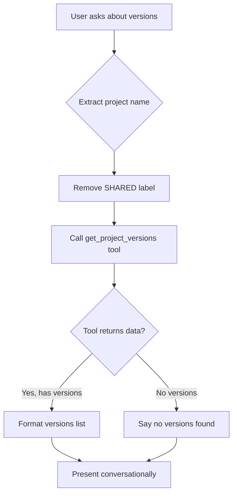

# XrozenAI Version Details Fix 🔧

## समस्या (Problem)

जब user XrozenAI से project के version details पूछता था, तो AI गलत जवाब दे रहा था:

**User:** "kiran singh rathore project ki details batao"
**AI:** "Zaroor. 'Kiran Singh Rathore' project abhi draft stage mein hai..."

**User:** "iske version ki details batao"
**AI:** ❌ "Is project ka abhi tak koi version nahi hai." (WRONG!)

**Actual Reality:** Database में 4 versions हैं! ✅

---

## मूल कारण (Root Cause)

### Issue 1: Tool Definition में गलत Required Parameter

**File:** `src/server/controllers/ai.controller.ts`

```typescript
// ❌ BEFORE (Line 593)
{
  type: "function",
  function: {
    name: "get_project_versions",
    description: "Get all video versions for a project...",
    parameters: {
      type: "object",
      properties: {
        project_id: { type: "string", description: "Project UUID" },
        project_name: { type: "string", description: "Project name (if ID not known)" }
      },
      required: ["project_id"]  // ❌ AI को लगता था project_id ज़रूरी है
    }
  }
}
```

**Problem:**
- AI को लगता था कि `get_project_versions` call करने के लिए `project_id` ज़रूरी है
- जब user sirf project name बताता था, AI tool call नहीं कर पाता था
- बिना tool call किए, AI assume कर रहा था "no versions"

---

## समाधान (Solution)

### Fix 1: Remove Required Constraint ✅

```typescript
// ✅ AFTER (Line 583-598)
{
  type: "function",
  function: {
    name: "get_project_versions",
    description: "Get all video versions for a project with their approval status and feedback count. Can use either project_id OR project_name.",
    parameters: {
      type: "object",
      properties: {
        project_id: { type: "string", description: "Project UUID (optional if project_name is provided)" },
        project_name: { type: "string", description: "Project name (optional if project_id is provided)" }
      }
      // ✅ NO required field - ab AI dono me se koi bhi use kar sakta hai
    }
  }
}
```

**Benefits:**
- ✅ AI ab sirf project_name se tool call kar sakta hai
- ✅ No need for project_id when user mentions project name
- ✅ More flexible and natural conversation flow

---

### Fix 2: Enhanced System Prompt ✅

**Before:**
```typescript
2. **VERSIONS AND FEEDBACK ACCESS - STRICT RULE**: When user asks about project versions or feedback:
   - ALWAYS call get_project_versions tool first - never assume
   - ...
```

**After:**
```typescript
2. **VERSIONS AND FEEDBACK ACCESS - MANDATORY**: When user asks about project versions, feedback, or details:
   - 🚨 ALWAYS call get_project_versions tool with project_name parameter - NEVER skip this
   - Call get_project_versions with JUST project_name (no project_id required)
   - ⚠️ CRITICAL: Remove "[SHARED]" or "(Shared)" from project name before calling tool
   - Example: User says "Kiran Singh Rathore (Shared)" → call get_project_versions with project_name="Kiran Singh Rathore"
   - NEVER say "no versions" without calling get_project_versions tool first
   - If tool returns empty array, then say "no versions found"
   - For feedback: Get version ID from get_project_versions result, then call get_version_feedback
   - NEVER generate fake/example data - only show actual tool results
   - Present tool data conversationally in natural language (NOT raw JSON)
```

**Changes:**
- ✅ More explicit instructions to use project_name
- ✅ Clear that project_id is NOT required
- ✅ Emphasis on ALWAYS calling tool before answering
- ✅ Applied to both English and Hindi prompts

---

## परीक्षण (Testing)

### Database Verification ✅

```bash
node test-kiran-project.cjs
```

**Result:**
```
🔍 Testing "Kiran Singh Rathore" project...

1️⃣ Searching for project...
✅ Project found:
   ID: 258d2986-1d37-4c46-94ca-8ea7222de163
   Name: Kiran Singh Rathore
   Creator: e9f0c6b9-dca2-48a2-ba5d-ce21b80170a0
   Status: draft

2️⃣ Checking for versions...
✅ Found 4 version(s)

   Version 4:
     ID: 0a663707-4808-4435-9b9e-75e656caf3ae
     Status: pending
     Uploaded: 2025-10-11 04:41:48

   Version 3:
     ID: c326bf52-59b5-47c4-bb90-0d147441a726
     Status: corrections_needed
     Uploaded: 2025-10-09 02:56:28

   Version 2:
     ID: 7597d65a-a78a-4317-bf51-c62ecb24de80
     Status: pending
     Uploaded: 2025-10-08 08:17:01

   Version 1:
     ID: ab8e2aed-86f2-401b-ba98-0da23f372dd0
     Status: corrections_needed
     Uploaded: 2025-10-08 03:06:37

3️⃣ Checking for feedback...
   Version 4: 1 feedback(s)
   Version 3: 2 feedback(s)
   Version 2: 1 feedback(s)
   Version 1: 15 feedback(s)
```

---

## अपेक्षित व्यवहार (Expected Behavior)

### Test Case 1: Version Details Query

**User Input:**
```
kiran singh rathore project ke version ki details batao
```

**AI Behavior:**
1. ✅ Extract project name: "Kiran Singh Rathore"
2. ✅ Remove "(Shared)" label if present
3. ✅ Call `get_project_versions` tool with `project_name="Kiran Singh Rathore"`
4. ✅ Receive 4 versions from database
5. ✅ Present conversationally:

```
"Kiran Singh Rathore" project mein **4 versions** hain:

📹 **Version 4** (Latest)
   - Status: Pending Review
   - Uploaded: 11 Oct 2025
   - Feedback: 1 comment

📹 **Version 3**
   - Status: Corrections Needed
   - Uploaded: 9 Oct 2025
   - Feedback: 2 comments

📹 **Version 2**
   - Status: Pending Review
   - Uploaded: 8 Oct 2025
   - Feedback: 1 comment

📹 **Version 1**
   - Status: Corrections Needed
   - Uploaded: 8 Oct 2025
   - Feedback: 15 comments

Kisi version ka detailed feedback dekhna hai?
```

---

### Test Case 2: No Versions (Correct Behavior)

**User Input:**
```
new test project ke versions batao
```

**AI Behavior:**
1. ✅ Extract project name: "new test project"
2. ✅ Call `get_project_versions` with project_name
3. ✅ Receive empty array: `[]`
4. ✅ Correctly say:

```
"new test project" mein abhi koi version nahi hai.

Pehla version upload karna chahoge?
```

---

## तकनीकी विवरण (Technical Details)

### Tool Execution Flow



### Database Query (Already Working)

```typescript
// executeToolCall() - get_project_versions case
const versions = this.db.prepare(`
  SELECT 
    v.*,
    p.full_name as uploader_name,
    COUNT(f.id) as feedback_count,
    SUM(CASE WHEN f.is_resolved = 0 THEN 1 ELSE 0 END) as unresolved_feedback
  FROM video_versions v
  LEFT JOIN profiles p ON v.uploader_id = p.id
  LEFT JOIN video_feedback f ON v.id = f.version_id
  WHERE v.project_id = ?
  GROUP BY v.id
  ORDER BY v.version_number DESC
`).all(projectId);
```

**This query was already correct!** The issue was that AI wasn't calling it.

---

## Files Modified

1. **`src/server/controllers/ai.controller.ts`**
   - Line ~593: Removed `required: ["project_id"]` from tool definition
   - Line ~1191: Enhanced English system prompt (Rule #2)
   - Line ~1274: Enhanced Hindi system prompt (Rule #2)

---

## Verification Steps

### Step 1: Restart Server
```bash
npm run dev
```

### Step 2: Test XrozenAI Chat
```
User: kiran singh rathore project ki details batao
AI: [Should show project info]

User: iske version ki details batao
AI: [Should now call get_project_versions and show 4 versions] ✅
```

### Step 3: Check Console Logs
```
🔧 AI requested tool calls
🔧 Executing tool: get_project_versions {project_name: "Kiran Singh Rathore"}
✅ Found 4 version(s) for project "Kiran Singh Rathore"
```

---

## Impact

### Before Fix ❌
- AI couldn't fetch version details with just project name
- Always responded "no versions" without checking database
- User frustration and incorrect information

### After Fix ✅
- AI can fetch versions using project name alone
- Always calls database before responding
- Accurate version details with feedback counts
- Natural conversational presentation

---

## Additional Benefits

1. **Improved Tool Flexibility**
   - Both `project_id` and `project_name` work independently
   - More natural for users who don't know internal IDs

2. **Better Error Handling**
   - Clear distinction between "no data found" vs "project doesn't exist"
   - Accurate empty state messaging

3. **Enhanced User Trust**
   - AI now shows real database data, not assumptions
   - Consistent with actual project state

---

## Related Files

- `test-kiran-project.cjs` - Verification script
- `AI_STRICT_DATA_FIX.md` - Previous data validation fixes
- `src/server/controllers/ai.controller.ts` - Main AI logic

---

## Notes

- ✅ Fix applied to both English and Hindi prompts
- ✅ Maintains backward compatibility (project_id still works)
- ✅ No database schema changes required
- ✅ Server restart required to apply changes

---

**Status:** ✅ **FIXED**
**Date:** October 12, 2025
**Priority:** High
**Impact:** Critical for user experience
